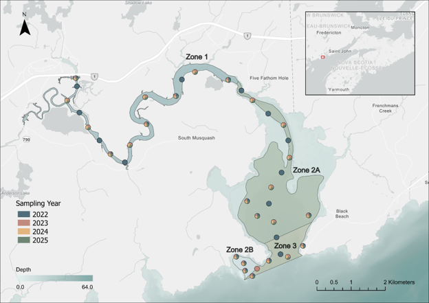
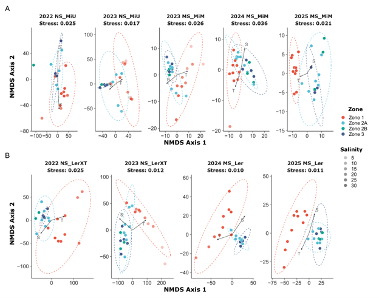

# Multi-marker eDNA metabarcoding assessment of fish, marine mammal, and invertebrate diversity in the macrotidal Musquash Estuary Marine Protected Area

Mohamed Fares, J. Andrew Cooper, Ryan R.E. Stanley, Evan Cronmiller, Vicky Yaroshewski, Meghan C. McBride, Harri Pettitt-Wade, Claude Nozeres, Robert G. Beiko, Nicholas W. Jeffery

__Abstract__
Marine Protected Areas (MPAs) require robust biodiversity baselines to support long-term conservation objectives and management. Establishing these baselines is particularly challenging in estuarine ecosystems, where freshwater-marine gradients and tidal dynamics generate heterogeneous communities that are difficult to comprehensively characterize using conventional sampling methods. We established a multi-year molecular baseline for the [Musquash Estuary MPA](https://www.dfo-mpo.gc.ca/oceans/mpa-zpm/musquash/index-eng.html) (Bay of Fundy, Canada) using eDNA metabarcoding surveys from 2022–2025, combining MiFish 12S and cytochrome c oxidase subunit I (COI) markers to characterize fish, marine mammal, and invertebrate assemblages spanning a pronounced salinity gradient. The markers revealed complementary biodiversity patterns: MiFish 12S recovered a persistent fish assemblage, including diadromous species of conservation concern (Anguilla rostrata, Acipenser oxyrinchus, Morone saxatilis) alongside marine species transiently occupying the estuary. COI expanded taxonomic coverage by detecting 92 invertebrate taxa, including zooplankton and macrobenthic species. Despite interannual variability in taxon detections, both markers yielded highly consistent spatial patterns across all survey years. The primary ecological transition occurred between upper estuarine and outer marine zones, reflecting gradual species turnover rather than abrupt boundaries aligned with administrative zoning. Marker-specific power analyses revealed that COI achieved 80% statistical power with approximately six sampling sites, whereas 12S required 9–10 sites to detect comparable spatial heterogeneity. Our results highlight that eDNA marker selection can influence sampling efficiency and monitoring design. These results establish an enhanced biodiversity baseline for the Musquash Estuary MPA, demonstrate how multi-marker eDNA metabarcoding can inform spatial stratification and sampling effort, and provide a transferable approach for optimizing long-term monitoring using eDNA in complex estuarine ecosystems.

__Figure 1.__ Study area and distribution of eDNA sampling stations within the Musquash Estuary Marine Protected Area. Sampling was conducted annually from 2022 to 2025 along the estuary’s freshwater-marine gradient. Coloured circles indicate the sampling years (2022–2025), while shaded polygons delineate Marine Protected Area management zones (Zones 1, 2A, 3, and 2B). Zone 1 represents the upper estuarine and riverine reaches; Zone 2A represents transitional brackish habitats; and Zones 3 and 2B correspond to the marine outer estuary. Bathymetric shading indicates relative water depth across the estuary. The inset map shows the location of the Musquash Estuary within the Bay of Fundy in Atlantic Canada. 

 
__Figure 6.__ NMDS ordination of Aitchison distances based on (A) 12S-derived (MiFish marker) and (B) COI-derived community structure. Facets represent specific year/protocol. Points (sampling sites) are colored by Zone, circumscribed by 95% confidence ellipse (omitted for groups with n ≤ 3). Point opacity scales dynamically with Salinity (greater opacity = higher salinity). Black vectors (S: salinity, T: temperature) indicate significant environmental drivers (P < 0.05, envfit). Stress values are indicated within panel headers.